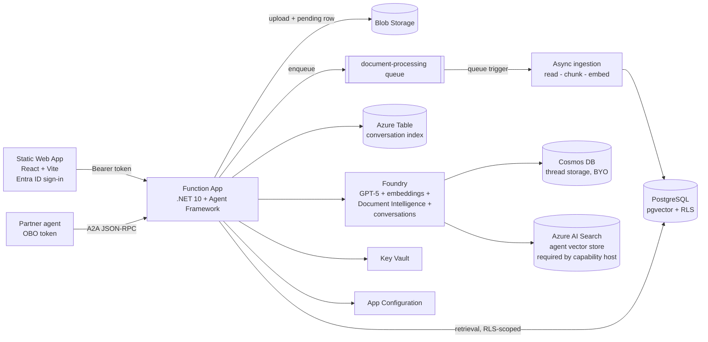

# 🧠 Cerebro

**Enterprise RAG on Azure — PostgreSQL `pgvector` + native Row-Level Security + Microsoft Foundry (BYO services)**

> "Cerebro amplifies Xavier's psychic powers, allowing him to detect mutants anywhere on the planet — but it doesn't show him everything. It reads *the signature of the person in the chair* and surfaces only what that signature is tuned to find."

That's the whole idea here, minus the psychic helmet. 🪖 Every query against this platform — chat, retrieval, document listing, all of it — is filtered through **native PostgreSQL row-level security**, keyed on *your* Entra ID identity. Two people can hit the exact same endpoint and get answers grounded in completely different documents, because the database itself is doing the reading of who's in the chair. No app-code ACL to forget, no admin flag to misconfigure — if you're not cleared to see it, RLS makes the row disappear before it ever reaches a retrieval result, an LLM prompt, or an API response. 🕵️

## 🧭 Principles

- 🔒 **RLS is the only ACL.** There is no parallel "check permissions in code" path — retrieval, listing, chat, all go through the same PostgreSQL policies. If a query bypasses `SetUserContextAsync`, it returns *zero rows*, never *someone else's* rows.
- 🕸️ **Private by default.** `PUBLIC_NETWORK_ACCESS=Disabled` is the default, not an add-on — PostgreSQL, Storage, Cosmos DB, Key Vault, App Configuration, Azure AI Search and Foundry all sit behind private endpoints in a VNet. The SPA and the Function App's own front door stay public by design (someone has to answer the browser); everything behind them doesn't have to.
- 🪪 **Entra ID end-to-end.** The same `oid`/`groups` claims that get a user through the front door are what the database reads to decide what they can see. Identity doesn't get translated or re-derived anywhere in between.
- 🧩 **Bring your own Foundry services.** Chat history lives in *your* Cosmos DB, not a black box you can't audit. This is a wiring pattern for BYO storage, not a hosted SaaS.
- 🏗️ **Managed identity everywhere.** The app talks to Postgres, Blob/Queue/Table, Cosmos, Key Vault, App Configuration and Foundry as itself — no connection strings, no secrets sitting in config waiting to leak.
- ⚡ **Solution accelerator, not a framework.** This is meant to be forked, read end-to-end, and adapted — not installed as a dependency.

## 🔍 What it does

- **Azure Database for PostgreSQL Flexible Server** with **pgvector** for chunk + embedding storage, protected by **native PostgreSQL Row-Level Security** (owner + optional Entra ID group sharing)
- **Microsoft Foundry (Azure AI Foundry)** hosts the chat model (GPT-5 series) and the embedding model
- **Azure Functions (C#, .NET 10 isolated)** backend built on the **Microsoft Agent Framework**
- **Asynchronous ingestion**: upload → Blob Storage → **queue trigger** → Foundry **Document Intelligence** (`prebuilt-read`) → chunking → embeddings → pgvector with citations
- **Chat history** in **Microsoft Foundry conversations**, backed by a **customer-managed Cosmos DB** account; an Azure Table maps users to their conversation ids so sessions resume correctly
- **Azure Static Web App** (React + Vite) example client with document upload, status tracking and a chat UI with conversation history
- **Entra ID authorization** end to end — the caller's `oid`/`groups` claims drive RLS on every retrieval
- **A2A**: agent card + JSON-RPC endpoint, including the **on-behalf-of (OBO)** flow so partner agents act *as the end user*, never as themselves
- **Enterprise networking**: VNet integration, private endpoints + private DNS everywhere it matters, managed identity everywhere, Key Vault for secrets, App Configuration for app settings



## 📁 Repository layout

| Path | Purpose |
|---|---|
| `infra/` | Bicep (azd-compatible): VNet, private endpoints, PostgreSQL, Foundry + Cosmos DB thread storage + Azure AI Search, Function App, Static Web App, Key Vault, App Configuration, monitoring |
| `db/schema.sql` | pgvector schema, tables and row-level security policies — the actual "Cerebro" |
| `scripts/setup.ps1` | **One-shot setup**: prerequisites, azd environment, app registration, `azd up`, post-deployment redirect URIs and (optionally) the database |
| `scripts/setup-app-registration.ps1` | Creates/updates the Entra ID app registration (API scope, groups claim, redirect URIs, client secret) |
| `scripts/setup-database.ps1` | Creates the managed-identity DB role and applies the schema |
| `scripts/teardown.ps1` | **One-shot teardown**: `azd down --force --purge` plus the app registration and stale azd values that `azd down` leaves behind |
| `src/RagApp.Functions/` | Function app: upload, async ingestion (queue trigger), chat agent, conversations, A2A endpoints |
| `src/web/` | React + Vite example client hosted on Azure Static Web Apps |

## 🔌 API

| Route | Method | Description |
|---|---|---|
| `/api/documents` | POST | Upload a document (`multipart/form-data`, field `file`; optional `groupIds` = comma-separated Entra group object ids to share with). Returns `202 Accepted` — processing continues asynchronously |
| `/api/documents` | GET | List documents visible to the caller (RLS), including ingestion `status` and `chunkCount` |
| `/api/chat` | POST | `{ "message": "...", "topK": 5, "conversationId": null }` → grounded answer + citations + `conversationId` |
| `/api/conversations` | GET | List the caller's conversations |
| `/api/conversations` | POST | Create a conversation (`{ "title": "..." }`) |
| `/api/conversations/{id}` | GET | Load a conversation's message history |
| `/api/conversations/{id}` | DELETE | Delete a conversation and its Foundry history |
| `/.well-known/agent-card.json` | GET | A2A agent card (advertises the OAuth2/OBO security scheme) |
| `/api/a2a` | POST | A2A JSON-RPC `message/send` endpoint |

All endpoints except the agent card require an `Authorization: Bearer <token>` Entra ID access token for the app's API scope.

## 🧵 Asynchronous ingestion

1. `POST /api/documents` inserts a `pending` row first (so the row exists before processing can pick it up), uploads the blob, then sends a `DocumentProcessingMessage` (`documentId`/`ownerOid`/`filename`/`blobName`) to the `document-processing` storage queue, and returns `202`.
2. A `[QueueTrigger]` — deliberately *not* `[BlobTrigger]` — picks the message up, sets the document to `processing`, extracts text with Document Intelligence, chunks it, generates embeddings and writes chunks + citations to pgvector, then marks the document `completed` (or `failed` with an error message).
3. It runs under the *app* identity, but reconstructs the **owner's** `UserContext` from the message, so writes still pass owner-scoped RLS. Nothing bypasses row-level security, not even the background worker. 🔁 Reprocessing is idempotent — existing chunks are deleted before new ones are written.

A classic `[BlobTrigger]` was tried first and dropped: its fast path depends on classic Storage Analytics logs, which aren't on by default on new storage accounts, so new blobs could sit undetected for many minutes. The queue trigger is explicit and immediate instead.

The SPA polls `/api/documents` while any document is `pending` or `processing`.

## 💬 Chat history

- History lives in **Microsoft Foundry conversations** (`/openai/v1/conversations`), persisted in the **customer-managed Cosmos DB** account attached to the Foundry project through a `CosmosDB` connection plus an `Agents` capability host.
- The capability host's connection set is **atomic**: `threadStorageConnections` (Cosmos DB), `storageConnections` (Blob Storage) and `vectorStoreConnections` (**Azure AI Search**) must all be supplied together, or the control plane rejects the configuration. That's why an Azure AI Search service is deployed even though document retrieval is served entirely by **pgvector** — Search only backs the agent runtime's own vector store and otherwise stays idle. It defaults to the cheapest usable tier; override with `azd env set SEARCH_SKU standard`.
- An **Azure Table** (`conversations`, `PartitionKey` = user object id) indexes each user's conversation ids and is the authorization boundary: a conversation can only be read, continued or deleted from the owner's partition.
- Not ready to pay for Azure AI Search? `azd env set USE_CUSTOM_FOUNDRY_STORAGE false` falls back to Microsoft-managed thread storage; Cosmos, Storage and Search connections and the capability hosts are skipped entirely.

## 🌐 Web application

`src/web` is a React + Vite + TypeScript SPA deployed to **Azure Static Web Apps** (Standard SKU):

- **Sign-in** uses Static Web Apps' built-in Entra ID authentication (`/.auth/login/aad`), and every route requires an authenticated user (`staticwebapp.config.template.json`).
- Static Web Apps doesn't surface downstream API tokens through `/.auth/me`, so the SPA additionally uses **MSAL** silent SSO to acquire an access token for `api://<client-id>/access_as_user` before calling the Function App.
- `npm run build` runs `scripts/generate-config.mjs`, which materializes `public/config.json` and `public/staticwebapp.config.json` from the azd environment. Both generated files are git-ignored.
- The app registration needs the Static Web App origin registered as an **SPA redirect URI**, and a **client secret** for the SWA auth provider (`azd env set AUTH_CLIENT_SECRET <secret>`).

## 🧠 The row-level security model (the actual Cerebro)

- `documents.owner_oid` = uploader's Entra object id; `document_acl` holds Entra **group** object ids a document is shared with.
- Per request the app opens a transaction and runs `SET LOCAL app.user_oid / app.groups` with the validated token claims. The database connection uses a **non-privileged role**, so `FORCE ROW LEVEL SECURITY` policies filter *every* query — including vector similarity search. There is no separate "can this user see this chunk" check anywhere in application code, because there doesn't need to be.

## 🚀 Deployment

### 1. Prerequisites

- Azure subscription; [azd](https://aka.ms/azd), Azure CLI, .NET 10 SDK, Node.js 20+, `psql`
- `az login` (the signed-in user becomes the PostgreSQL Entra administrator)

### 2. One-shot setup

```powershell
./scripts/setup.ps1 -EnvironmentName cerebro-dev
```

That single script does everything:

1. Verifies `az` / `azd` and the signed-in Azure context.
2. Creates or selects the azd environment.
3. Creates/updates the **Entra ID app registration** — `access_as_user` scope, `groups` claim, SPA + Static Web Apps redirect URIs, client secret — and writes `AUTH_CLIENT_ID` / `AUTH_CLIENT_SECRET` into the environment.
4. Sets the remaining azd settings (PostgreSQL Entra admin, location, network access). **No password is set** — the PostgreSQL admin password is generated inside Bicep and stored in Key Vault as `postgres-admin-password`.
5. Runs `azd up` (provision + deploy).
6. Registers the deployed Static Web App origin on the app registration and redeploys the web client so `config.json` picks up the final values.
7. Optionally initializes the database (`-InitializeDatabase`).

Useful switches:

| Switch | Purpose |
|---|---|
| `-PublicNetworkAccess Enabled` | Dev/test: reach PostgreSQL and the other services from your machine |
| `-InitializeDatabase` | Also run `setup-database.ps1` after deployment (requires `psql` and public access) |
| `-SkipDeploy` | Only configure the app registration and the azd environment |
| `-Location` / `-StaticWebAppLocation` | Override the default `swedencentral` / `westeurope` regions |
| `-AppRegistrationDisplayName` | Name of the Entra app registration (defaults to the environment name) |

Default location is **`swedencentral`** (PostgreSQL Flexible Server capacity is constrained in many other regions).

<details>
<summary>Running the steps manually</summary>

```powershell
azd env new cerebro-dev
./scripts/setup-app-registration.ps1 -DisplayName cerebro-dev -ApplyToAzdEnv
azd env set POSTGRES_ENTRA_ADMIN_OBJECT_ID (az ad signed-in-user show --query id -o tsv)
azd env set POSTGRES_ENTRA_ADMIN_PRINCIPAL_NAME (az ad signed-in-user show --query userPrincipalName -o tsv)
azd env set PUBLIC_NETWORK_ACCESS Disabled   # Enabled for dev/test
azd up
./scripts/setup-app-registration.ps1 -DisplayName cerebro-dev -StaticWebAppHostname (azd env get-value STATIC_WEB_APP_URL) -SkipSecret
azd deploy web
```

Equivalent portal steps for the app registration: expose an API with scope `access_as_user` and Application ID URI `api://<client-id>`; add the **groups** claim to access and id tokens; add a **Single-page application** redirect URI for the Static Web App origin plus `http://localhost:5173`; add a **Web** redirect URI `https://<swa-hostname>/.auth/login/aad/callback`; create a client secret; note the client id → `AUTH_CLIENT_ID`.

</details>

### 3. Initialize the database

Run from a network with access to the server (private endpoint, or temporarily set `PUBLIC_NETWORK_ACCESS=Enabled`):

```powershell
./scripts/setup-database.ps1 -ServerName <psql-server-name> -FunctionAppName <function-app-name>
```

This creates the function app's managed-identity role (`pgaadauth_create_principal`), applies `db/schema.sql` (tables + RLS policies) and grants least-privilege permissions.

> The embedding dimension in `db/schema.sql` (`vector(1536)`) must match `Rag:EmbeddingDimensions` in App Configuration (1536 fits `text-embedding-3-large` when truncated, or use 3072 and update both).

### 4. Tear down

```powershell
./scripts/teardown.ps1 -EnvironmentName cerebro-dev -DeleteAppRegistration
```

Resource names are derived from `uniqueString(subscription().id, environmentName)`, so redeploying under the same environment name reuses the same names. Key Vault and the Foundry account are only *soft*-deleted, and their tombstones then collide with the new deployment (`a resource with this name already exists or is in a conflicting state`). The script therefore runs `azd down --force --purge`, which purges them so the names are immediately reusable.

It also cleans up the two things `azd down` cannot: the Entra ID app registration (it lives in the directory, not the resource group; pass `-DeleteAppRegistration`) and the azd environment values that still point at deleted resources. Add `-DeleteAzdEnvironment` to remove the local environment entirely, or `-WhatIf` to see what would happen first.

Plain `azd down --force --purge` works too if you only care about the Azure resources.

## 🤝 Agent-to-agent (A2A) with on-behalf-of

Partner agents discover this agent via `GET /.well-known/agent-card.json`. The card advertises an OAuth2 security scheme: callers must present a token **for the end user**, so RLS applies to *that user* — never to the calling app. Cerebro doesn't care who's driving; it only reads the signature of the person in the chair.

A partner agent that received a user token for *its own* API exchanges it using the **OBO grant**:

```csharp
var app = ConfidentialClientApplicationBuilder.Create(partnerAgentClientId)
    .WithClientSecret(partnerAgentSecret)          // or certificate
    .WithTenantId(tenantId)
    .Build();

var result = await app.AcquireTokenOnBehalfOf(
        scopes: ["api://<rag-api-client-id>/access_as_user"],
        userAssertion: new UserAssertion(incomingUserAccessToken))
    .ExecuteAsync();

// JSON-RPC call as the user
using var http = new HttpClient();
http.DefaultRequestHeaders.Authorization = new("Bearer", result.AccessToken);
await http.PostAsJsonAsync("https://<function-app>/api/a2a", new
{
    jsonrpc = "2.0",
    id = "1",
    method = "message/send",
    @params = new { message = new { role = "user", parts = new[] { new { kind = "text", text = "What does the Q3 report say?" } } } }
});
```

Requirement: the partner agent's app registration must have **delegated permission** to this API's `access_as_user` scope (admin-consented).

## 🛠️ Local development

```bash
cd src/RagApp.Functions
cp local.settings.sample.json local.settings.json   # fill in values
func start
```

Locally the app authenticates with your `az login` identity (`DefaultAzureCredential`); set `Rag__PostgresUser` to your Entra UPN and run the schema against a dev server with public access enabled.

For the web client:

```bash
cd src/web
npm install
$env:VITE_API_BASE_URL="http://localhost:7071"; $env:VITE_AZURE_TENANT_ID="<tenant>"; $env:VITE_AZURE_CLIENT_ID="<client-id>"
npm run dev
```

`/.auth/me` only exists when the app runs on Static Web Apps; locally use the SWA CLI (`swa start`) or sign in through the MSAL popup.

> **Windows note:** the Functions worker SDK generates a nested `WorkerExtensions` project whose own build output adds roughly 120 characters to the path. On a deep checkout this used to exceed `MAX_PATH` and fail with `MSB3030` (`Could not copy ... because it was not found`). `RagApp.Functions.csproj` now redirects that generated project to `%LOCALAPPDATA%\FuncWorkerExt\<project>\<configuration>` whenever the project directory is longer than 60 characters, so the build works from any path. Enabling Win32 long paths is still worthwhile for other tooling.

## 🛡️ Security notes

- All data-plane access uses the function app's **system-assigned managed identity** (Blob Data Owner, Queue/Table Data Contributor for the queue trigger and conversation index, Cognitive Services OpenAI User, Cognitive Services User, Key Vault Secrets User, App Configuration Data Reader; Entra-native PostgreSQL role).
- The Foundry project identity gets Cosmos DB Operator + built-in Cosmos data contributor, Storage Blob Data Contributor, and Search Index Data Contributor + Search Service Contributor so agent conversations persist to your own accounts; Cosmos and Azure AI Search local auth are disabled and both are reached over Entra only.
- Conversation ownership is enforced by the Azure Table index, so Foundry conversation ids are never usable across users (including through the A2A `contextId`).
- `disableLocalAuth` is set on Foundry and App Configuration; storage blob public access is off.
- Easy Auth (`authsettingsV2`) rejects unauthenticated requests at the platform edge when `AUTH_CLIENT_ID` is set; the code additionally validates the JWT and extracts `oid`/`groups` for RLS.
- With `PUBLIC_NETWORK_ACCESS=Disabled`, the *backing* services (PostgreSQL, Storage, Cosmos DB, Key Vault, App Configuration, Azure AI Search and Foundry) are reachable only through private endpoints inside the VNet, and the function app reaches them over VNet integration. The function app's own front end stays internet-facing by design: the SPA calls it from the browser, and it is protected by Easy Auth plus code-level JWT validation rather than by network isolation. The Static Web App is likewise public.
- **App Configuration is the one exception during provisioning.** ARM writes its key-values over the *data* plane, which it cannot reach through a private endpoint unless the deployment itself runs inside the VNet. The store is therefore created with `dataPlaneProxy.authenticationMode: Pass-through`, opened by the azd `preprovision` hook (`scripts/unlock-appconfig-network.*`) and closed again by the `postprovision` hook (`scripts/lock-appconfig-network.*`) once the key-values are written. Opening it in a separate step rather than in the template itself is deliberate: a network rule change made during the deployment takes up to a minute to reach the data plane, so same-deployment writes fail intermittently with `Forbidden`. `disableLocalAuth` stays `true` throughout, so the store never accepts anything but Entra credentials, and the deploying principal is granted App Configuration Data Owner so the pass-through writes succeed. If the hook is interrupted, re-run `azd provision` or close the window manually with `az appconfig update --name <store> --resource-group <rg> --enable-public-network false`.
- The PostgreSQL local admin password is **generated during deployment** from a per-deployment GUID (`newGuid()`), never handled by a human or written to the azd environment, and stored in Key Vault as `postgres-admin-password`. It exists only for break-glass access — the application authenticates with Entra. Because it is regenerated on each `azd up`, pin it with `azd env set POSTGRES_ADMIN_PASSWORD '<value>'` if you need a stable value.
