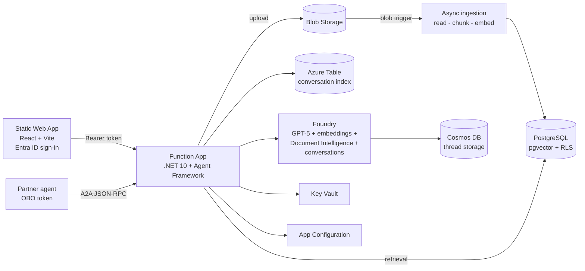

# Enterprise RAG on Azure — PostgreSQL pgvector + Microsoft Foundry + Agent Framework

Retrieval-augmented generation platform with **per-user row-level security**:

- **Azure Database for PostgreSQL Flexible Server** with **pgvector** for chunk + embedding storage, protected by **native PostgreSQL Row-Level Security** (owner + optional Entra ID group sharing)
- **Microsoft Foundry (Azure AI Foundry)** hosting the chat model (GPT-5 series, deployment name parameterized) and the embedding model
- **Azure Functions (C#, .NET 10 isolated)** backend built on the **Microsoft Agent Framework**
- **Asynchronous ingestion**: upload → Azure Blob Storage (returns `202`) → **blob trigger** → Foundry **Document Intelligence** (`prebuilt-read`) → chunking → embeddings → pgvector with citations
- **Chat history** in **Microsoft Foundry conversations**, backed by a **customer-managed Cosmos DB** account; an Azure Table maps users to their conversation ids so sessions can be resumed
- **Azure Static Web App** (React + Vite) example client with document upload, status tracking and a chat UI with conversation history
- **Entra ID authorization** end to end; the caller's `oid`/`groups` claims drive RLS on retrieval
- **A2A**: agent card + JSON-RPC endpoint, including the **on-behalf-of (OBO)** flow so partner agents act as the end user
- **Enterprise networking**: VNet integration, private endpoints + private DNS for PostgreSQL, Blob/Table/Queue, Cosmos DB, Key Vault, App Configuration and Foundry; managed identity everywhere; Key Vault for secrets; App Configuration for app settings



## Repository layout

| Path | Purpose |
|---|---|
| `infra/` | Bicep (azd-compatible): VNet, private endpoints, PostgreSQL, Foundry + Cosmos DB thread storage, Function App, Static Web App, Key Vault, App Configuration, monitoring |
| `db/schema.sql` | pgvector schema, tables and row-level security policies |
| `scripts/setup.ps1` | **One-shot setup**: prerequisites, azd environment, app registration, `azd up`, post-deployment redirect URIs and (optionally) the database |
| `scripts/setup-app-registration.ps1` | Creates/updates the Entra ID app registration (API scope, groups claim, redirect URIs, client secret) |
| `scripts/setup-database.ps1` | Creates the managed-identity DB role and applies the schema |
| `src/RagApp.Functions/` | Function app: upload, async ingestion (blob trigger), chat agent, conversations, A2A endpoints |
| `src/web/` | React + Vite example client hosted on Azure Static Web Apps |

## API

| Route | Method | Description |
|---|---|---|
| `/api/documents` | POST | Upload a document (`multipart/form-data`, field `file`; optional `groupIds` = comma-separated Entra group object ids to share with). Returns `202 Accepted` — processing continues asynchronously |
| `/api/documents` | GET | List documents visible to the caller (RLS), including ingestion `status` and `chunkCount` |
| `/api/chat` | POST | `{ "message": "...", "topK": 5, "conversationId": null }` → grounded answer + citations + `conversationId` |
| `/api/conversations` | GET | List the caller's conversations |
| `/api/conversations` | POST | Create a conversation (`{ "title": "..." }`) |
| `/api/conversations/{id}` | GET | Load a conversation's message history |
| `/api/conversations/{id}` | DELETE | Delete a conversation and its Foundry history |
| `/.well-known/agent-card.json` | GET | A2A agent card (advertises the OAuth2/OBO security scheme) |
| `/api/a2a` | POST | A2A JSON-RPC `message/send` endpoint |

All endpoints except the agent card require an `Authorization: Bearer <token>` Entra ID access token for the app's API scope.

## Asynchronous ingestion

1. `POST /api/documents` writes the file to the `documents` container with metadata (`ownerOid`, `documentId`, `groupIds`, `originalFilename`) and inserts a `pending` row, then returns `202`.
2. The `ProcessDocument` **blob trigger** picks the blob up, sets the document to `processing`, extracts text with Document Intelligence, chunks it, generates embeddings and writes chunks + citations to pgvector, then marks the document `completed` (or `failed` with an error message).
3. The trigger runs under the app identity but re-establishes the **owner's** RLS context from blob metadata, so nothing bypasses row-level security.

The SPA polls `/api/documents` while any document is `pending` or `processing`.

## Chat history

- History lives in **Microsoft Foundry conversations** (`/openai/v1/conversations`), persisted in the **customer-managed Cosmos DB** account attached to the Foundry project through a `CosmosDB` connection plus an `Agents` capability host (`threadStorageConnections` + `storageConnections`; no Azure AI Search is needed because retrieval is served by pgvector).
- An **Azure Table** (`conversations`, `PartitionKey` = user object id) indexes each user's conversation ids and is the authorization boundary: a conversation can only be read, continued or deleted from the owner's partition.
- If the capability-host configuration is rejected in your region, set `azd env set USE_CUSTOM_FOUNDRY_STORAGE false` to fall back to Microsoft-managed thread storage.

## Web application

`src/web` is a React + Vite + TypeScript SPA deployed to **Azure Static Web Apps** (Standard SKU):

- **Sign-in** uses Static Web Apps' built-in Entra ID authentication (`/.auth/login/aad`), and every route requires an authenticated user (`staticwebapp.config.template.json`).
- Static Web Apps does not surface downstream API tokens through `/.auth/me`, so the SPA additionally uses **MSAL** silent SSO to acquire an access token for `api://<client-id>/access_as_user` before calling the Function App.
- `npm run build` runs `scripts/generate-config.mjs`, which materializes `public/config.json` (API base URL, tenant id, client id, API scope) and `public/staticwebapp.config.json` from the azd environment. Both generated files are git-ignored.
- The app registration needs the Static Web App origin registered as an **SPA redirect URI**, and a **client secret** for the SWA auth provider (`azd env set AUTH_CLIENT_SECRET <secret>`).

## Row-level security model

- `documents.owner_oid` = uploader's Entra object id; `document_acl` holds Entra **group** object ids a document is shared with.
- Per request the app opens a transaction and runs `SET LOCAL app.user_oid / app.groups` with the validated token claims; the database connection uses a **non-privileged role**, so PostgreSQL RLS policies filter every query — including vector similarity search.

## Deployment

### 1. Prerequisites

- Azure subscription; [azd](https://aka.ms/azd), Azure CLI, .NET 10 SDK, Node.js 20+, `psql`
- `az login` (the signed-in user becomes the PostgreSQL Entra administrator)

### 2. One-shot setup

```powershell
./scripts/setup.ps1 -EnvironmentName rag-dev
```

That single script does everything:

1. Verifies `az` / `azd` and the signed-in Azure context.
2. Creates or selects the azd environment.
3. Creates/updates the **Entra ID app registration** — `access_as_user` scope, `groups` claim, SPA + Static Web Apps redirect URIs, client secret — and writes `AUTH_CLIENT_ID` / `AUTH_CLIENT_SECRET` into the environment.
4. Sets the remaining azd settings (PostgreSQL Entra admin, location, network access). **No password is set** — the PostgreSQL admin password is generated inside Bicep and stored in Key Vault as `postgres-admin-password`.
5. Runs `azd up` (provision + deploy).
6. Registers the deployed Static Web App origin on the app registration and redeploys the web client so `config.json` picks up the final values.
7. Optionally initializes the database (`-InitializeDatabase`).

Useful switches:

| Switch | Purpose |
|---|---|
| `-PublicNetworkAccess Enabled` | Dev/test: reach PostgreSQL and the other services from your machine |
| `-InitializeDatabase` | Also run `setup-database.ps1` after deployment (requires `psql` and public access) |
| `-SkipDeploy` | Only configure the app registration and the azd environment |
| `-Location` / `-StaticWebAppLocation` | Override the default `swedencentral` / `westeurope` regions |
| `-AppRegistrationDisplayName` | Name of the Entra app registration (defaults to the environment name) |

Default location is **`swedencentral`** (PostgreSQL Flexible Server capacity is constrained in many other regions).

<details>
<summary>Running the steps manually</summary>

```powershell
azd env new rag-dev
./scripts/setup-app-registration.ps1 -DisplayName rag-dev -ApplyToAzdEnv
azd env set POSTGRES_ENTRA_ADMIN_OBJECT_ID (az ad signed-in-user show --query id -o tsv)
azd env set POSTGRES_ENTRA_ADMIN_PRINCIPAL_NAME (az ad signed-in-user show --query userPrincipalName -o tsv)
azd env set PUBLIC_NETWORK_ACCESS Disabled   # Enabled for dev/test
azd up
./scripts/setup-app-registration.ps1 -DisplayName rag-dev -StaticWebAppHostname (azd env get-value STATIC_WEB_APP_URL) -SkipSecret
azd deploy web
```

Equivalent portal steps for the app registration: expose an API with scope `access_as_user` and Application ID URI `api://<client-id>`; add the **groups** claim to access and id tokens; add a **Single-page application** redirect URI for the Static Web App origin plus `http://localhost:5173`; add a **Web** redirect URI `https://<swa-hostname>/.auth/login/aad/callback`; create a client secret; note the client id → `AUTH_CLIENT_ID`.

</details>

### 3. Initialize the database

Run from a network with access to the server (private endpoint, or temporarily set `PUBLIC_NETWORK_ACCESS=Enabled`):

```powershell
./scripts/setup-database.ps1 -ServerName <psql-server-name> -FunctionAppName <function-app-name>
```

This creates the function app's managed-identity role (`pgaadauth_create_principal`), applies `db/schema.sql` (tables + RLS policies) and grants least-privilege permissions.

> The embedding dimension in `db/schema.sql` (`vector(1536)`) must match `Rag:EmbeddingDimensions` in App Configuration (1536 fits `text-embedding-3-large` when truncated, or use 3072 and update both).

## Agent-to-agent (A2A) with on-behalf-of

Partner agents discover this agent via `GET /.well-known/agent-card.json`. The card advertises an OAuth2 security scheme: callers must present a token **for the end user**, so RLS applies to that user — never to the calling app.

A partner agent that received a user token for *its own* API exchanges it using the **OBO grant**:

```csharp
var app = ConfidentialClientApplicationBuilder.Create(partnerAgentClientId)
    .WithClientSecret(partnerAgentSecret)          // or certificate
    .WithTenantId(tenantId)
    .Build();

var result = await app.AcquireTokenOnBehalfOf(
        scopes: ["api://<rag-api-client-id>/access_as_user"],
        userAssertion: new UserAssertion(incomingUserAccessToken))
    .ExecuteAsync();

// JSON-RPC call as the user
using var http = new HttpClient();
http.DefaultRequestHeaders.Authorization = new("Bearer", result.AccessToken);
await http.PostAsJsonAsync("https://<function-app>/api/a2a", new
{
    jsonrpc = "2.0",
    id = "1",
    method = "message/send",
    @params = new { message = new { role = "user", parts = new[] { new { kind = "text", text = "What does the Q3 report say?" } } } }
});
```

Requirement: the partner agent's app registration must have **delegated permission** to this API's `access_as_user` scope (admin-consented).

## Local development

```bash
cd src/RagApp.Functions
cp local.settings.sample.json local.settings.json   # fill in values
func start
```

Locally the app authenticates with your `az login` identity (`DefaultAzureCredential`); set `Rag__PostgresUser` to your Entra UPN and run the schema against a dev server with public access enabled.

For the web client:

```bash
cd src/web
npm install
$env:VITE_API_BASE_URL="http://localhost:7071"; $env:VITE_AZURE_TENANT_ID="<tenant>"; $env:VITE_AZURE_CLIENT_ID="<client-id>"
npm run dev
```

`/.auth/me` only exists when the app runs on Static Web Apps; locally use the SWA CLI (`swa start`) or sign in through the MSAL popup.

> **Windows note:** the Functions build emits deeply nested paths under `obj/.../WorkerExtensions/...`. If the repository path is long you may hit `MSB3030` (`MAX_PATH`); build from a shorter path (e.g. a directory junction) or enable Win32 long paths.

## Security notes

- All data-plane access uses the function app's **system-assigned managed identity** (Blob Data Owner, Queue/Table Data Contributor for the blob trigger and conversation index, Cognitive Services OpenAI User, Cognitive Services User, Key Vault Secrets User, App Configuration Data Reader; Entra-native PostgreSQL role).
- The Foundry project identity gets Cosmos DB Operator + built-in Cosmos data contributor and Storage Blob Data Contributor so agent conversations persist to your own accounts; Cosmos local auth is disabled.
- Conversation ownership is enforced by the Azure Table index, so Foundry conversation ids are never usable across users (including through the A2A `contextId`).
- `disableLocalAuth` is set on Foundry and App Configuration; storage blob public access is off.
- Easy Auth (`authsettingsV2`) rejects unauthenticated requests at the platform edge when `AUTH_CLIENT_ID` is set; the code additionally validates the JWT and extracts `oid`/`groups` for RLS.
- With `PUBLIC_NETWORK_ACCESS=Disabled`, all backing services are reachable only through private endpoints inside the VNet.
- The PostgreSQL local admin password is **generated during deployment** from a per-deployment GUID (`newGuid()`), never handled by a human or written to the azd environment, and stored in Key Vault as `postgres-admin-password`. It exists only for break-glass access — the application authenticates with Entra. Because it is regenerated on each `azd up`, pin it with `azd env set POSTGRES_ADMIN_PASSWORD '<value>'` if you need a stable value.
