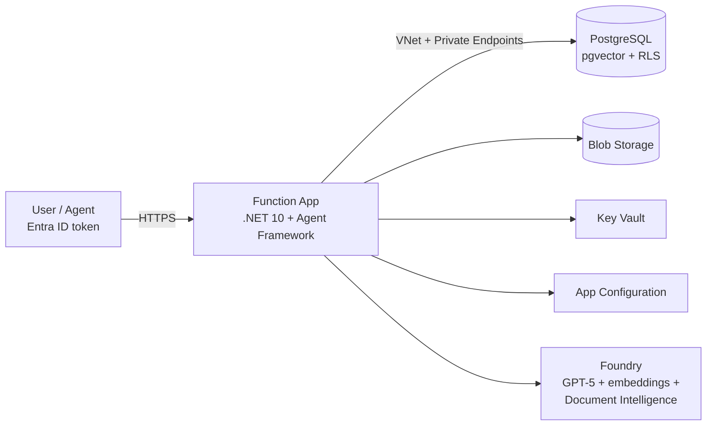

# Enterprise RAG on Azure — PostgreSQL pgvector + Microsoft Foundry + Agent Framework

Retrieval-augmented generation platform with **per-user row-level security**:

- **Azure Database for PostgreSQL Flexible Server** with **pgvector** for chunk + embedding storage, protected by **native PostgreSQL Row-Level Security** (owner + optional Entra ID group sharing)
- **Microsoft Foundry (Azure AI Foundry)** hosting the chat model (GPT-5 series, deployment name parameterized) and the embedding model
- **Azure Functions (C#, .NET 10 isolated)** backend built on the **Microsoft Agent Framework**
- **Document ingestion**: upload → Azure Blob Storage → Foundry **Document Intelligence** (`prebuilt-read`) → chunking → embeddings → pgvector with citations
- **Entra ID authorization** end to end; the caller's `oid`/`groups` claims drive RLS on retrieval
- **A2A**: agent card + JSON-RPC endpoint, including the **on-behalf-of (OBO)** flow so partner agents act as the end user
- **Enterprise networking**: VNet integration, private endpoints + private DNS for PostgreSQL, Blob, Key Vault, App Configuration and Foundry; managed identity everywhere; Key Vault for secrets; App Configuration for app settings



## Repository layout

| Path | Purpose |
|---|---|
| `infra/` | Bicep (azd-compatible): VNet, private endpoints, PostgreSQL, Foundry, Function App, Key Vault, App Configuration, monitoring |
| `db/schema.sql` | pgvector schema, tables and row-level security policies |
| `scripts/setup-database.ps1` | Creates the managed-identity DB role and applies the schema |
| `src/RagApp.Functions/` | Function app: ingestion, chat agent, A2A endpoints |

## API

| Route | Method | Description |
|---|---|---|
| `/api/documents` | POST | Upload a document (`multipart/form-data`, field `file`; optional `groupIds` = comma-separated Entra group object ids to share with) |
| `/api/documents` | GET | List documents visible to the caller (RLS) |
| `/api/chat` | POST | `{ "message": "...", "topK": 5 }` → grounded answer + citations |
| `/.well-known/agent-card.json` | GET | A2A agent card (advertises the OAuth2/OBO security scheme) |
| `/api/a2a` | POST | A2A JSON-RPC `message/send` endpoint |

All endpoints except the agent card require an `Authorization: Bearer <token>` Entra ID access token for the app's API scope.

## Row-level security model

- `documents.owner_oid` = uploader's Entra object id; `document_acl` holds Entra **group** object ids a document is shared with.
- Per request the app opens a transaction and runs `SET LOCAL app.user_oid / app.groups` with the validated token claims; the database connection uses a **non-privileged role**, so PostgreSQL RLS policies filter every query — including vector similarity search.

## Deployment

### 1. Prerequisites

- Azure subscription; [azd](https://aka.ms/azd), Azure CLI, .NET 10 SDK, `psql`
- An **Entra ID app registration** for the API:
  - Expose an API → scope `access_as_user`; Application ID URI `api://<client-id>`
  - Token configuration → add the **groups** claim to access tokens
  - Note the client id → `AUTH_CLIENT_ID`

### 2. Provision + deploy

```bash
azd init          # pick an environment name
azd env set AUTH_CLIENT_ID <app-registration-client-id>
azd env set POSTGRES_ENTRA_ADMIN_OBJECT_ID $(az ad signed-in-user show --query id -o tsv)
azd env set POSTGRES_ENTRA_ADMIN_PRINCIPAL_NAME $(az ad signed-in-user show --query userPrincipalName -o tsv)
azd env set POSTGRES_ADMIN_PASSWORD '<strong-password>'      # stored in Key Vault
azd env set PUBLIC_NETWORK_ACCESS Disabled                   # Enabled for dev/test
azd up
```

Default location is **`swedencentral`** (PostgreSQL Flexible Server capacity is constrained in many other regions); override with `azd env set AZURE_LOCATION <region>`.

### 3. Initialize the database

Run from a network with access to the server (private endpoint, or temporarily set `PUBLIC_NETWORK_ACCESS=Enabled`):

```powershell
./scripts/setup-database.ps1 -ServerName <psql-server-name> -FunctionAppName <function-app-name>
```

This creates the function app's managed-identity role (`pgaadauth_create_principal`), applies `db/schema.sql` (tables + RLS policies) and grants least-privilege permissions.

> The embedding dimension in `db/schema.sql` (`vector(1536)`) must match `Rag:EmbeddingDimensions` in App Configuration (1536 fits `text-embedding-3-large` when truncated, or use 3072 and update both).

## Agent-to-agent (A2A) with on-behalf-of

Partner agents discover this agent via `GET /.well-known/agent-card.json`. The card advertises an OAuth2 security scheme: callers must present a token **for the end user**, so RLS applies to that user — never to the calling app.

A partner agent that received a user token for *its own* API exchanges it using the **OBO grant**:

```csharp
var app = ConfidentialClientApplicationBuilder.Create(partnerAgentClientId)
    .WithClientSecret(partnerAgentSecret)          // or certificate
    .WithTenantId(tenantId)
    .Build();

var result = await app.AcquireTokenOnBehalfOf(
        scopes: ["api://<rag-api-client-id>/access_as_user"],
        userAssertion: new UserAssertion(incomingUserAccessToken))
    .ExecuteAsync();

// JSON-RPC call as the user
using var http = new HttpClient();
http.DefaultRequestHeaders.Authorization = new("Bearer", result.AccessToken);
await http.PostAsJsonAsync("https://<function-app>/api/a2a", new
{
    jsonrpc = "2.0",
    id = "1",
    method = "message/send",
    @params = new { message = new { role = "user", parts = new[] { new { kind = "text", text = "What does the Q3 report say?" } } } }
});
```

Requirement: the partner agent's app registration must have **delegated permission** to this API's `access_as_user` scope (admin-consented).

## Local development

```bash
cd src/RagApp.Functions
cp local.settings.sample.json local.settings.json   # fill in values
func start
```

Locally the app authenticates with your `az login` identity (`DefaultAzureCredential`); set `Rag__PostgresUser` to your Entra UPN and run the schema against a dev server with public access enabled.

## Security notes

- All data-plane access uses the function app's **system-assigned managed identity** (Blob Data Contributor, Cognitive Services OpenAI User, Cognitive Services User, Key Vault Secrets User, App Configuration Data Reader; Entra-native PostgreSQL role).
- `disableLocalAuth` is set on Foundry and App Configuration; storage blob public access is off.
- Easy Auth (`authsettingsV2`) rejects unauthenticated requests at the platform edge when `AUTH_CLIENT_ID` is set; the code additionally validates the JWT and extracts `oid`/`groups` for RLS.
- With `PUBLIC_NETWORK_ACCESS=Disabled`, all backing services are reachable only through private endpoints inside the VNet.
